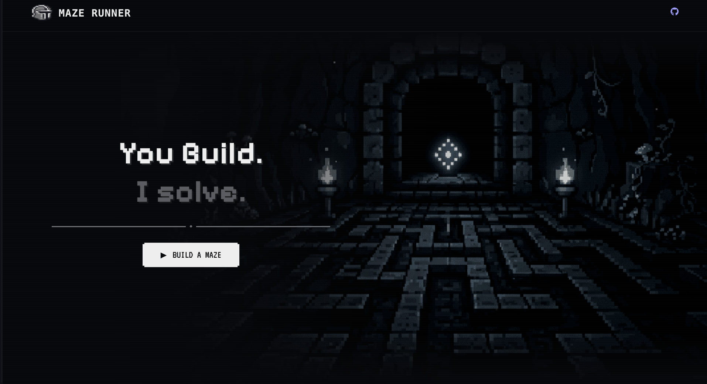
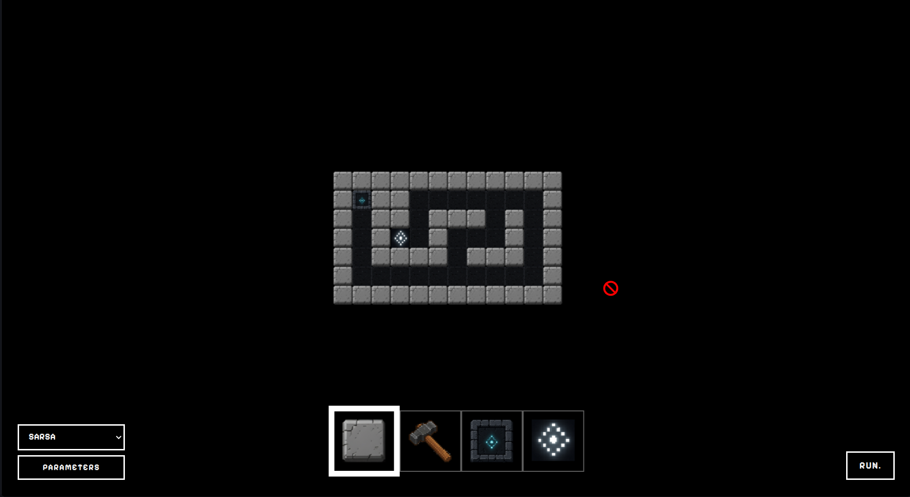
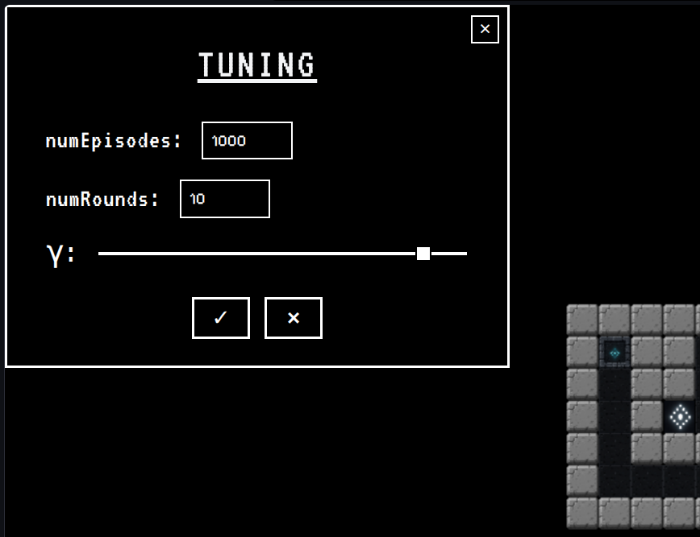
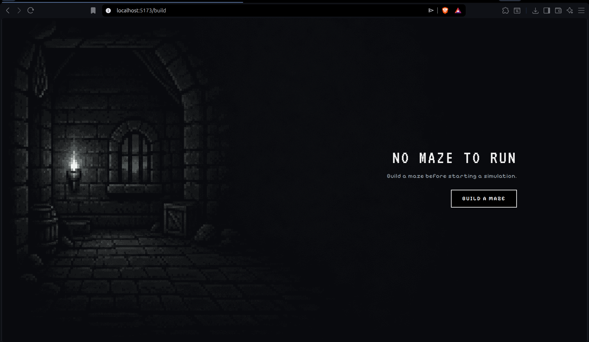
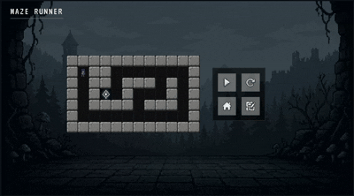
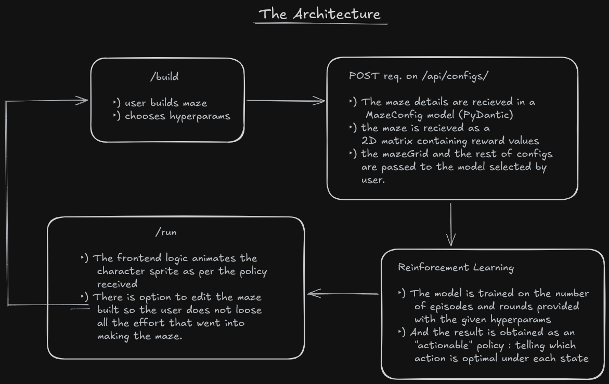

# 🏰 Maze Runner

A platform where RL agent solves the mazes built by **you**.


## 📸 Demo / Screenshots

<table>
  <tr>
    <td></td>
    <td></td>
  </tr>
  <tr>
    <td></td>
    <td></td>
  </tr>
</table> 
<p align="center">

</p>

## What is Maze Runner?
Maze runner was built as a project to implement what I have learnt in Reinforcement Learning till now in a fun way. The inspiration for the name came from the movie blade runner (altho the theme is quite contrasting).

## Features
- Custom maze creation
- Monte Carlo control
- SARSA 
- Configurable hyperparameters
- Policy visualization
- Collision / loop handling
- Animated character

## Tech Stack
#### Frontend
- React
- Vite

#### Backend
- FastAPI
- Python

#### RL
- NumPy

## System Architecture



## RL Algorithms

How does the RL agent find the path ?

Both the models currently implemented follow the 
same strategy : HIT and TRIAL but with improvements
from each run passed. 
Meanwhile calculating the 'return' from the actions taken in each state and storing it.
Ultimately the actions which gave the highest in return in a particular state (this is called Q value) is considered the optimal action.

*Both models currently use on-policy control.

### Difference b/w MC and SARSA:

**MC** waits for the episode to end (either naturally or via forced external interference) to calculate the returns for the (state, action) pairs encountered.

**SARSA** (model based on Temporal Difference Learning) on the other hand calculates the return for (s, a) just after that action. Hence it generally converges faster than MC.

Observed runs shows drastic difference b/w SARSA and MC : where SARSA is perfoming appreciably better than MC.

## Project Structure
```
├── backend
│   ├── __init__.py
│   └── main.py
├── frontend
│   ├── components
│   ├── index.css
│   ├── index.html
│   ├── index.jsx
│   ├── pages
│   ├── public
│   └── tools.jsx
├── README.md
├── requirements.txt
└── rl
    ├── core.py
    └── __init__.py
```

## Running Locally

1. Clone the repo.
2. Change the fetch url in Build.jsx under sendMazeDetails function to `http://localhost:8000/api/configs/`
3. Install the required packages with : </br> 
    a. `cd frontend && npm install` </br>
    b. `pip install -r requirements.txt`
4. Start the frontend with command:
`npm run dev`
4. Start the backend with command:
 `uvicorn backend.main:app --reload`


## Future Plans
- More blocks (like mud and possibly traps)
- Visualization of paths as disovered by the agent in real time.
- More models.
- Player vs RL challenge.